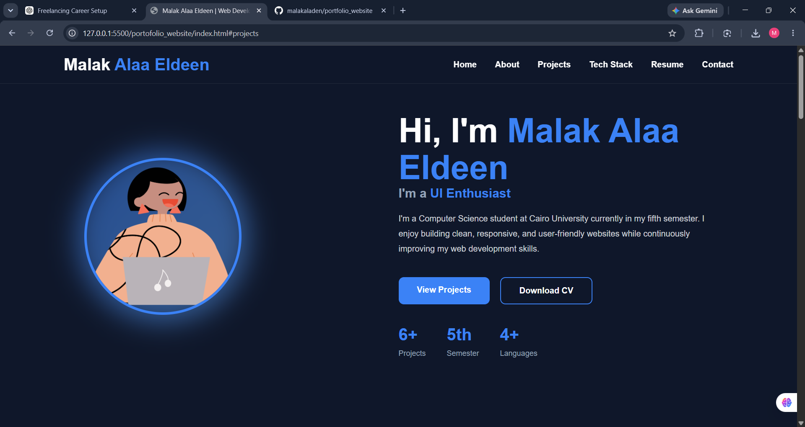

# 🌐 Portfolio Website

A modern and responsive personal portfolio built to showcase my projects, technical skills, and experience as a Computer Science student at Cairo University.

## ✨ Features

- Responsive design
- Modern and clean UI
- Project showcase
- Downloadable resume
- Contact section
- Smooth scrolling animations

## 🛠️ Built With

- HTML5
- CSS3
- JavaScript

## 📸 Screenshots



## 🚀 Live Demo

https://malakaladen.github.io/portfolio_website/

## 📂 Project Structure

```text
Portfolio/
│
├── assets/
├── css/
├── js/
├── index.html
└── README.md
```

## 👩‍💻 Author

**Malak Alaa**

- GitHub: https://github.com/malakaladen
- LinkedIn: https://www.linkedin.com/in/malak-alaa-806b21341/
